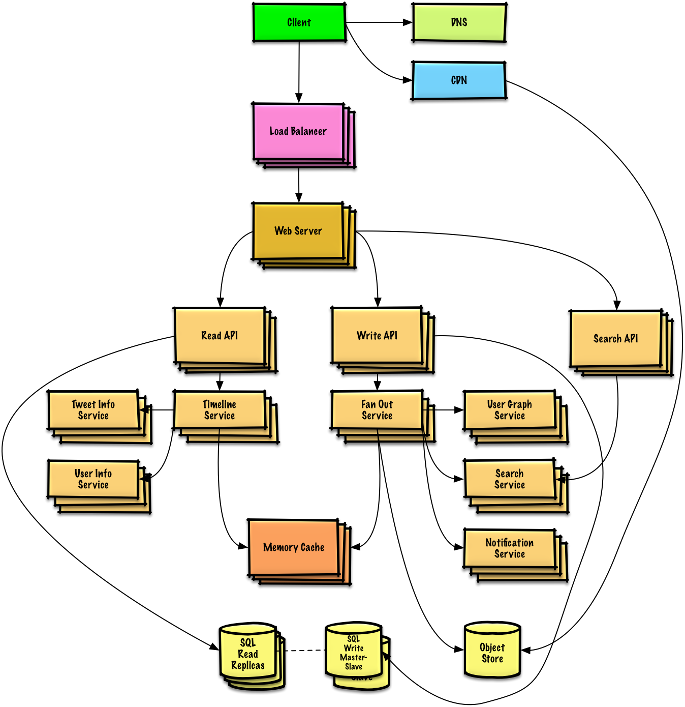

# The System Design Primer

  
   

## Index of system design topics

> Summaries of various system design topics, including pros and cons.  **Everything is a trade-off**.
>
> Each section contains links to more in-depth resources.

  
   

## Availability vs consistency

